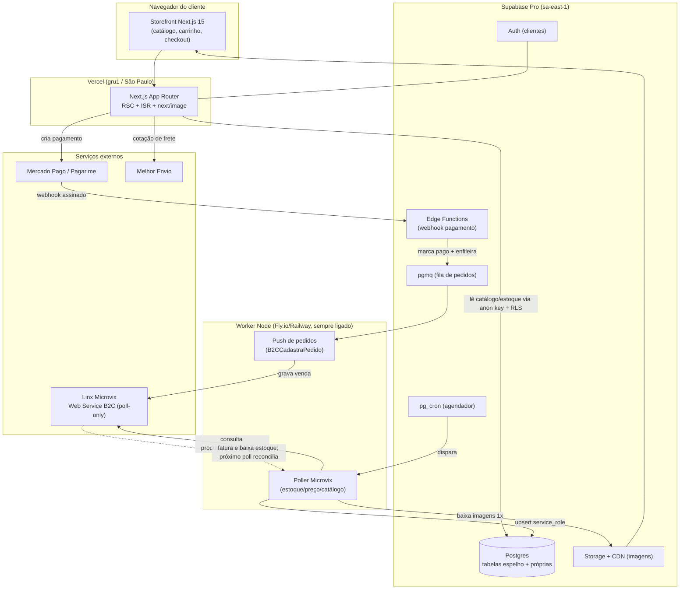

# Arquitetura — Uzzo Store (e-commerce)

> Loja de roupas em Balneário Camboriú (SC). O ERP **Linx Microvix** é a **fonte de verdade** de produtos, estoque e preços. Este documento consolida a pesquisa técnica e define a arquitetura, o plano de construção e o que precisa ser confirmado com a Linx.
>
> Última atualização: 2026-07-25.

---

## 1. Decisões-chave (resumo)

| Área | Decisão | Por quê |
|------|---------|---------|
| **Frontend** | **Next.js 15** (App Router + React Server Components, React 19) + TypeScript | SEO por página de produto (SSR/ISR), `next/image` para catálogo pesado em imagens, ecossistema maduro, integra nativamente com Supabase e Vercel |
| **Backend / dados** | **Supabase** (Postgres + Auth + Storage + Edge Functions) como **cache de leitura** e banco do site | Microvix continua dono do estoque; o site nunca chama o ERP no caminho da requisição |
| **NÃO usar** | Medusa / Vendure / Saleor (commerce headless) | Trariam um segundo motor de estoque/preço/pedido e criariam o problema de "dois donos do estoque". O Microvix já é o backend de commerce |
| **Integração ERP** | **Web Service B2C do Microvix** (bidirecional: lê catálogo/estoque/preço, grava pedidos) | É a superfície feita para e-commerce; a mesma que os conectores oficiais (Linx IO) consomem |
| **Modelo de sync** | **Poll (polling agendado)** — o Microvix **NÃO tem webhooks** em nenhuma superfície | Fato confirmado em toda a pesquisa. Toda a arquitetura assume polling |
| **Worker de sync** | Orquestração no Supabase (pg_cron + fila pgmq) + **1 worker Node pequeno sempre ligado** para o I/O XML/SOAP do Microvix | Edge Functions têm limite de 2s de CPU — arriscado para parsear catálogos grandes em XML |
| **Pagamentos** | **Mercado Pago** (primário) · **Pagar.me/Stone** (fallback) | Pix a 0,99%, SDK Node/TS, Checkout Bricks (dados de cartão fora do nosso servidor), webhooks assinados. Stripe **descartado** (Pix é invite-only para lojista BR) |
| **Frete** | **Melhor Envio** + retirada na loja + motoboy local (BC/Itajaí/Camboriú) | Grátis, paga por etiqueta, API OAuth2 limpa, não exige contrato próprio com Correios |
| **Hosting** | **Vercel Pro** (região gru1/São Paulo) + **Supabase Pro** (sa-east-1) — ~US$ 45/mês | Baixa latência no Brasil, dados no Brasil (ajuda LGPD). Supabase Pro é obrigatório (o free pausa após 7 dias ocioso) |
| **Analytics** | **Plausible** ou **Umami** (cookieless) | Sem dado pessoal → dispensa banner de consentimento de analytics (LGPD) |
| **E-mail** | **Resend** (confirmação de pedido) em domínio `.com.br` com SPF/DKIM/DMARC | DX first, templates em React |

---

## 2. Diagrama de arquitetura

**Fluxo em uma frase:** o Microvix é a fonte de verdade; um worker faz *poll* e enche o cache no Supabase; o site lê só o Supabase; no checkout, o pagamento é confirmado por webhook e a venda é empurrada de volta para o Microvix, que dá baixa no estoque.

---

## 3. Integração com o Linx Microvix (o ponto crítico)

### 3.1. Fatos que definem tudo
- **Não existe webhook / push** em nenhuma superfície do Microvix. Integração é **100% polling**.
- Acesso é **liberado pela Linx**, não é self-service. É preciso acionar o gerente de relacionamento (franquia Linx/Microvix) para **contratar/habilitar o módulo B2C** e emitir a **chave de acesso** + confirmar o **CNPJ**. **Isso tem prazo e é o verdadeiro gargalo do projeto — deve ser iniciado já.**

### 3.2. Superfícies de API
1. **Web Service B2C** — *a superfície certa para e-commerce* (bidirecional).
   - Host: `webapi.microvix.com.br/1.0/api/integracao` (consultas) e `/importador.svc` (gravações).
   - Auth: HTTP Basic `linx_b2c` / `linx_b2c` + **chave** + `cnpjEmp` por loja.
   - **Leitura:** `B2CConsultaProdutos`, `B2CConsultaProdutosDetalhes`, `B2CConsultaProdutosDetalhesDepositos` (**estoque**), `B2CConsultaProdutosCustos` (**preço**), `B2CConsultaProdutosPromocao`, `B2CConsultaProdutosCodebar`, `B2CConsultaImagensHD` (imagens), `B2CConsultaMarcas/Setores/Linhas`, `B2CConsultaClientes`, `B2CConsultaPedidos`, `B2CConsultaNFe`.
   - **Gravação:** `B2CCadastraCliente(s)`, `B2CCadastraPedido` (exige `id_status` inicial), `B2CCadastraPedidoItens`, `B2CCancelaPedido`.
2. **WebApi genérica de extração** (`linx_export` + chave) — comandos `LinxProdutos`, `LinxProdutosDetalhes`, `LinxProdutosPreco`, `LinxSaldoEstoque`, delta por `dt_update_inicial/fim`, suporta `ResponseFormat=json`. **Só leitura** — útil para *backfill* em massa noturno (a Linx limita acesso em massa à janela 0h–3h).
3. **API de Integração REST (JSON)** (`api-integracao.microvix.com.br`, homolog `hom.api-integracao.microvix.com.br`) — moderna, mas hoje cobre fluxos **financeiros/fiscais**, não o catálogo. Secundária para nós.

### 3.3. Regras do Microvix que afetam o catálogo
- O produto só aparece na API se estiver marcado **"Disponível para loja virtual = SIM"**.
- **Variações (grade):** tamanho e cor vêm pela *grade*; a **variante (não o produto)** é a unidade vendável. Só sincroniza se a grade estiver associada ao produto.
- **Baixa de estoque:** venda online **não** dá baixa no checkout — o estoque só cai quando o pedido é importado e **faturado** dentro do Microvix; o próximo *poll* de estoque reflete isso.
- GTIN/EAN só é importado na **criação** do produto, não é atualizado depois.
- Endpoints clássicos aparecem em docs como `http://` — **confirmar HTTPS** antes de trafegar credenciais/PII.

---

## 4. Modelo de dados no Supabase

**Regra de ouro:** catálogo/estoque/preço = **espelho, nunca editar no site**; cliente/carrinho/pedido/SEO = **próprio do site**.

### 4.1. Tabelas espelho (escritas só pelo sync, `service_role`)
- `products` — `id_microvix`, sku/referência, nome, marca, NCM, categoria, `active_ecommerce`, `source_timestamp`
- `product_variants` — a grade tamanho×cor: `cod_barra`/EAN, tamanho, cor, `product_id` (unidade vendável)
- `stock_cache` — `variant_id`, `deposito_id`, `qty_available`, `last_synced_at`, `source_timestamp`
- `prices` — `variant/product`, `tabela_id`, preço, `promo_price`, `valid_from/to`
- `categories` — hierarquia setor/linha/coleção

### 4.2. Tabelas próprias do site (Supabase é a fonte de verdade)
- Camada SEO/editorial sobre o produto: `slug`, meta title/description, descrição rica, destaque, ordem, imagens curadas
- `customers` (`id = auth.uid()`, nome, CPF, telefone), `addresses`
- `carts` / `cart_items` (efêmeros), `reservations` (reserva de estoque com TTL curto)
- `orders` (status, totais, frete, `payment_status`, `microvix_order_id`, `microvix_synced_at`)
- `order_items` (**snapshot** de preço + variante no momento da compra — nunca reler do cache)
- `payments` (provider, `provider_id`, status)
- `sync_state` / `sync_runs` (watermark por método + log de execução)

### 4.3. Segurança (RLS)
- **RLS ligado em TODAS as tabelas** (o esquecimento é a vulnerabilidade nº 1 em projetos Supabase).
- Catálogo: policy de `SELECT` para `anon` + `authenticated` (idealmente `active_ecommerce = true`); **sem escrita pelo cliente**.
- Privadas: `USING`/`WITH CHECK` com `auth.uid() = user_id`. **Indexar** toda coluna usada em policy (ex. `user_id`).
- `service_role` e credenciais do Microvix/pagamento **só no servidor** (Edge Functions / worker / env server-side). Nunca em `NEXT_PUBLIC_*`.

---

## 5. Sincronização (o coração da operação)

### 5.1. Cadências recomendadas
| Dado | Frequência | Método |
|------|-----------|--------|
| **Estoque** | **1–5 min** (começar em 5, piso documentado; negociar mais rápido para SKUs quentes) | `B2CConsultaProdutosDetalhesDepositos` |
| Preço / promoção | 15–30 min | `B2CConsultaProdutosCustos` / `...Promocao` |
| Catálogo (produtos, atributos) | 15–60 min (delta) + **reconcile completo à noite** (janela 0h–3h) | `B2CConsultaProdutos(+Detalhes)` |
| Imagens | 1x e sob mudança → salvar em Supabase Storage/CDN | `B2CConsultaImagensHD` |

Cada execução usa **watermark** (último `timestamp`/`dt_update`) para puxar só o delta.

### 5.2. Onde roda (híbrido recomendado)
- **Supabase**: `pg_cron` agenda, `pgmq` é a fila de pedidos + *dead-letter*, tabelas espelho + `sync_state`.
- **1 worker Node sempre ligado** (Fly.io/Railway/Render, ~US$ 5–7/mês): faz o I/O XML/SOAP/CSV do Microvix (sem o limite de 2s de CPU das Edge Functions), guarda os segredos do Microvix, roda o job noturno + poll de estoque + consumidor da fila.

### 5.3. Controle de overselling (loja física + online no mesmo estoque)
- Vender só quando `saldo_microvix − buffer_segurança − reservas_ativas > 0`.
- No add-to-cart/checkout: criar **reserva com TTL curto** no Supabase; um `pg_cron` expira reservas abandonadas.
- Revalidar contra o último saldo no momento da autorização do pagamento; falhar graciosamente se faltar.
- O **próximo poll do Microvix é a verdade** (sempre vence a reserva local). Aceitar risco residual dentro da janela e ter *fallback* (backorder/estorno).

### 5.4. Ciclo do pedido (idempotente)
1. Carrinho no Supabase → checkout → cria `order` **pending**.
2. Webhook do provedor de pagamento → **Edge Function verifica a assinatura** (corpo cru) → marca pago (chave única = `payment_intent_id` = idempotência).
3. Enfileira `push_sale_to_microvix` no pgmq.
4. Worker consome → `B2CCadastraPedido`/`importador.svc` com cliente + itens + série de NF + plano de pagamento; usa o código do pedido como *idempotency key* (checa `B2CConsultaPedidos` antes de reenviar).
5. Microvix emite NF-e e baixa estoque; próximo poll reconcilia o cache.
6. Status de fulfillment vem **por poll** (`B2CConsultaPedidoStatus`/`B2CConsultaNFe`) — o retorno de status é limitado (para em FATURADO sem o módulo Correios).
7. Retry: visibility timeout + backoff; após ~5 tentativas → dead-letter + alerta.

---

## 6. Pagamentos

- **Primário: Mercado Pago** — Pix 0,99%; SDK Node oficial com tipos TS; **Checkout Bricks** (campos tokenizados, cartão nunca toca nosso servidor → PCI SAQ-A); webhooks assinados (`x-signature`); parcelamento + "receber na hora". Usar **Bricks embutido** (não o redirect) para manter o cliente no site.
- **Fallback: Pagar.me (Stone)** — API-first, SDK Node, mesmo grupo do ERP (Microvix=Linx=Stone → vantagem comercial/conciliação). ⚠️ A integração "nativa" Linx↔Pagar.me é só ponte de **POS físico**, não checkout web — o checkout online se constrói via API como qualquer gateway.
- **Descartado: Stripe** — Pix via EBANX e **invite-only para lojista domiciliado no BR**, sem parcelamento nativo.
- **Sempre:** confirmação dirigida por **webhook assinado e idempotente** no servidor, nunca pelo redirect do navegador. Guardar só token + últimos 4 dígitos + bandeira.

---

## 7. Camada operacional

- **Frete:** **Melhor Envio** (OAuth2; token 30d/refresh 45d; cotação→carrinho→compra→etiqueta→rastreio; sandbox com R$ 10k). Adicionar **retirada na loja (grátis)** e **motoboy local** por faixa de CEP (BC/Itajaí/Camboriú) — geralmente o mais barato/rápido e ótimo para conversão. Backup: SuperFrete. Evitar Kangu (encerrou em 2025), Frenet (exige contrato próprio) e Correios CWS direto (burocrático).
- **Hosting:** Vercel Pro (funções em gru1) + Supabase Pro (sa-east-1) ≈ **US$ 45/mês**. Supabase Pro é obrigatório.
- **SEO:** ISR nas páginas de produto, JSON-LD `Product/Offer` (preço/disponibilidade em BRL) no HTML inicial, `app/sitemap.ts` + `app/robots.ts`, `next/image`. Metas Core Web Vitals: LCP < 2,5s, INP < 200ms, CLS < 0,1.
- **LGPD** (ANPD fiscalizando forte desde out/2025): analytics **cookieless** (Plausible/Umami) dispensa banner de analytics; ainda são necessários **política de privacidade**, banner de consentimento para pixels de marketing, e um **encarregado (DPO)**. Dados no Brasil (sa-east-1) ajudam.
- **E-mail:** Resend (grátis 3k/mês) em domínio `.com.br` (registro.br) com SPF/DKIM/DMARC.

---

## 8. Stack / bibliotecas

Next.js 15 (App Router, RSC) · Tailwind CSS v4 + shadcn/ui (Radix) · React Hook Form + Zod · Zustand (carrinho) · TanStack Query (bits client-side) · `next/image` (Supabase Storage/CDN) · Metadata API + JSON-LD · `Intl` para BRL. **Sem lib de i18n** enquanto for só pt-BR.

---

## 9. Custo mensal estimado (loja pequena)

| Item | ~US$/mês |
|------|----------|
| Vercel Pro | 20 |
| Supabase Pro | 25 |
| Worker Node (Fly.io/Railway) | 5–7 |
| Resend | 0 (grátis até 3k) |
| Melhor Envio | 0 (paga por etiqueta) |
| Plausible (ou Umami self-host = 0) | 0–9 |
| **Total** | **~US$ 50–60/mês** + domínio + taxas de pagamento por venda |

---

## 10. Roadmap em fases

- **Fase 0 — Fundação (não depende da Linx):** repo, Next.js 15 + TS + Tailwind/shadcn, projeto Supabase Pro (sa-east-1), esquema inicial + RLS, deploy na Vercel, layout base pt-BR. → *já dá pra ter um site "casca" no ar.*
- **Fase 1 — Catálogo (desbloqueia quando a chave B2C sair):** worker Node, poll de catálogo/preço/estoque → Supabase, ingestão de imagens, páginas de listagem e produto com ISR/SEO. Enquanto a chave não vem, trabalhar com **dados mock**/homologação.
- **Fase 2 — Carrinho + checkout:** carrinho, reservas de estoque, cotação Melhor Envio, contas de cliente (Auth).
- **Fase 3 — Pagamento:** Mercado Pago (Bricks) + Edge Function webhook idempotente.
- **Fase 4 — Pedido → Microvix:** fila pgmq + push `B2CCadastraPedido`, reconciliação de status por poll.
- **Fase 5 — Operação:** e-mails (Resend), analytics, LGPD (política + banner + DPO), observabilidade (Sentry + `sync_runs` + heartbeat), rastreio.

---

## 11. Riscos e incertezas (confirmar com a Linx / no build)

- **Especificações exatas** dos métodos B2C (assinaturas, XML vs JSON, versão — WS B2C evoluiu de V21 a V39) estão atrás do login da Linx. Confirmar ao obter acesso; validar em **homologação**.
- **Rate limits / paginação / janelas de data** não são públicos — desenhar poll conservador e confirmar com o gerente.
- **Momento exato da baixa de estoque** (reserva na captura vs. só na NF-e) depende da config B2C da loja + buffer SQL Server intermediário — validar em homologação.
- **HTTPS** disponível para o tenant da loja — confirmar antes de trafegar credenciais.
- Credenciais reais (`chave` + CNPJ) são específicas — não confiar nos defaults documentados.
- Escolha final do gateway e economics de parcelamento são decisão comercial — confirmar nas páginas oficiais e em proposta assinada.

---

## 12. O que precisa ser providenciado (ação humana)

1. **[URGENTE / gargalo]** Acionar o gerente Linx/Microvix para **habilitar o módulo B2C** e emitir a **chave de acesso B2C** (`linx_b2c` em `webapi.microvix.com.br/1.0/api/integracao`) + confirmar o **CNPJ**. Pedir também acesso à **homologação**.
2. Confirmar que os produtos a vender estão marcados **"Disponível para loja virtual = SIM"** e com **grade** (tamanho/cor) associada no Microvix.
3. Decidir o **gateway de pagamento** (recomendação: Mercado Pago) e criar a conta.
4. Registrar o **domínio `.com.br`** (registro.br).
5. Criar as contas: **Supabase (Pro)**, **Vercel**, **Melhor Envio**, **Resend**.
